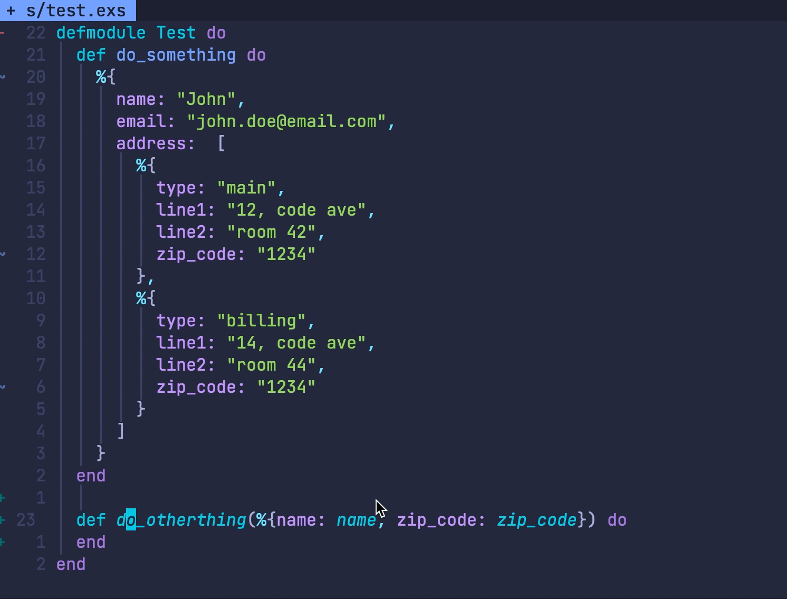

# ExMaps

Converts Elixir maps from atom to string and vice versa.

**Note**: This is in a very initial stage and probably contains some bugs.


## Instalation

```lua
use 'ustrajunior/ex_maps'

lua require("ex_maps").setup {
	create_mappings = true,
	line_mapping = "mtt",
	operator_mapping = "mt",
}
```

## How to use

You have basically two options. Put the cursor in the line you want to convert and press "mtt", or in visual mode, press "mt".

## demo


## Credits

I based and copied some code from [nvim-comment](https://github.com/terrortylor/nvim-comment) for the visual selection, so thanks [Alex Tylor](https://github.com/terrortylor).
